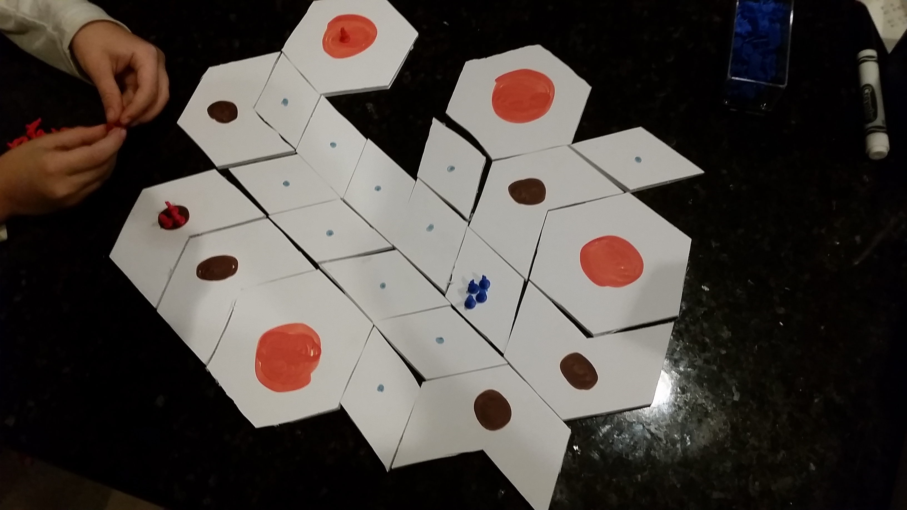

# Background

Your species is faced with a harsh reality: prosper or perish.

To prosper, your species must conquer planets scattered throughout the system. Some of these planets are more desirable than others. Some have already been conquered, and require an offensive to rid the planet of the competing colony.

If you fail to prosper, you **will** be invaded. Spread too slowly, and you'll fail to amass the army necessary for a proper defense. Spread out too quickly and you'll leave your defenses spread thin, allowing an enemy to quickly conquer your citizenship.

## Overview

## Concepts

### Ships

Each wooden block represents 1 ship. Attacking and colonizing requires moving your ships around the board, as well as sacrificing them for the greater good of the civilization. Each planet regenerate ships, so it's important to colonize planets when you can.

## Planets

The big red dots are big planets, the slightly smaller ones are medium planets, and the small blue dots are small planets.

Each planet has three attributes:

- Production
- Natives
- Population Limit

### Production

Colonized planets build ships according to their production value.

- Small planets produce 2 ships per turn.
- Medium planets produce 5 ships per turn.
- Large planets produce 8 ships per turn.

Planets occupied by natives have no ship growth.

### Natives 

All planets have natives living on them. Even conquered planets have natives (they're simply subdued). If an occupying force completely leaves the planet, any new attempts to conquer the planets require suppressing the natives again.

- Small planets have no natives. It costs nothing to conquer a small planet.
- Medium planets have 4 natives.
- Large planets have 12 natives.

### Ship Limits

Each planet has a ship limit, depending on its size. 

- Small planets are limited to 15 ships.
- Medium planets are limited to 30 ships.
- Large planets are limited to 60 ships.

## Game Phases

### Initial Colonization

The game starts by populating the star system. Each player begins with 30 ships to settle the planets. 

Starting with player one, each player populates a single planet with as many or few ships as they'd like (so long as it's one more than the number of natives on the planet). Each player then takes a turn populating a single planet until the last player is reached. The order then reverses, with the last player going first and the player one going last. This process repeats itself until all players have used their 30 ships.

Settling a planet requires defeating the natives, but at only half the normal rate. For example, if you want to settle a large planet (12 natives), you will lose 6 of your ships in the process (half the normal amount of 12). Ships lost due to natives go back in to the main supply and are not available until the main phase begins.

### Main Phases

The game is compromised of two phases: Movement and Production. The game cycles between the two phases until one player has eradicated all the enemy players.

#### Movement Phase

Turns are compromised of each player moving their ships up to 3 times (both passive movement and attacking). If the player so desires, they may complete their turn without taking all 3 movement opportunities. 

A single "movement" means moving any number of ships from one planet to another. For example, moving 3 ships from Planet A to Planet B counts as one "movement". Moving a ship each from Planet A and Planet B to Planet C counts as two movements.

Movement happens sequentially, meaning each player completes their 3 movements individually. In a three player game, player one will make their 3 moves, then player two with make theirs, then the third player will take their 3 moves.

The movement phase ends when all players have completed their 3 moves. The starting player for the next turn is the person sitting to the left of the current starting player (player one to begin with).

##### Passive Movement

Ships may move to any friendly populated planet, regardless of distance, as long as it's connected by other friendly planets. If there isn't a path that doesn't involve crossing an enemy or native populated planet, then the ship may not move to that planet. It would first have to defeat the enemy/native populated planets to connect the two.

##### Attacking Movement

You may move your citizens to any adjacent planet that you do no currently own. This is considered an attack, as you'll either be fighting natives or attacking another player.

###### Attacking Occupied Planets

Each enemy occupied planet provides 1 defense to the player who currently inhabits it. To defeat an occupying force, you'll have to attack with at least 1 more ship than are currently on the planet.

Example: If you have a planet with 8 ships and I attack with 10, then I win the planet and have 1 ship left on the planet as defense. If you wanted to retake the planet during your turn, you'd need to attack with at least 3 ships (2 will die and 1 will remain). If you attack with only 2 ships, then no player remains on the planet and the natives regain control.

###### Attacking Natives

Unoccupied planets have natives that you must quell in order to inhabit. Native do not benefit from the defense bonus (i.e. it's a straight 1:1 cost). To conquer a planet with 4 natives, you'll need 5 ships (4 to defeat the natives and 1 left over to defend the planet). There's no point in attacking with only 4 ships, as the natives will stay in control after defeating your 4 ships.

### Production Phase

After all players have had a chance to move their ships 3 times, the production phase begins. Each player will add ships to their planets according to its productivity.

For example, if you have 2 ships on a large planet, you'll add 8 more ships to the planet for a total of 10 ships. These ships are immediately ready for action during the next movement phase.

After all players have completed their production, a new movement phase begins. 
